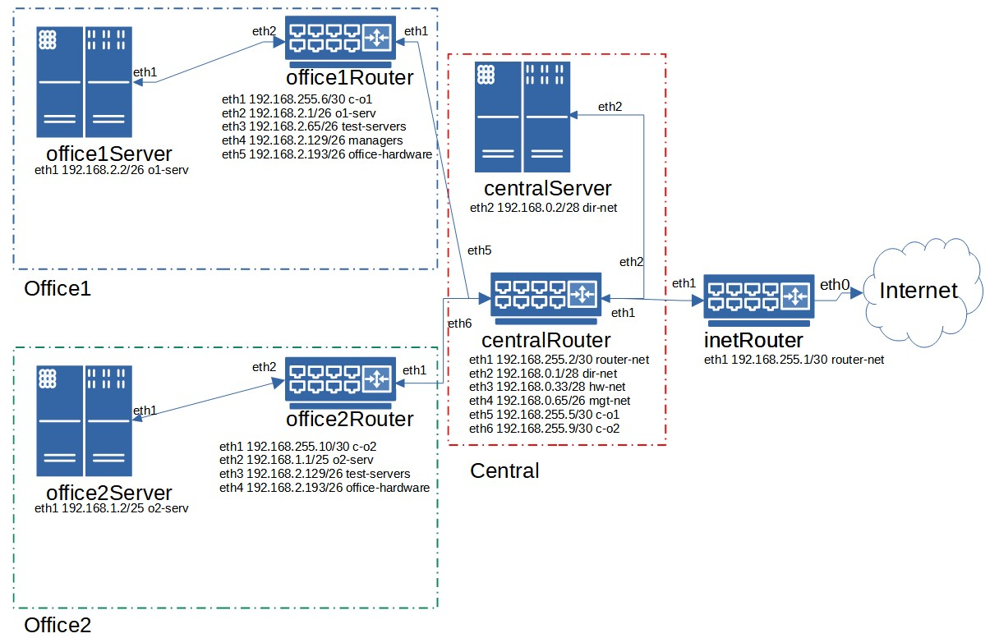

# ДЗ 25. Архитектура сетей

разворачиваем сетевую лабораторию
otus-linux

Vagrantfile - для стенда урока 9 - Network

Дано

https://github.com/erlong15/otus-linux/tree/network (ветка network)

Vagrantfile с начальным построением сети

    inetRouter
    centralRouter
    centralServer

тестировалось на virtualbox
Планируемая архитектура

построить следующую архитектуру

Сеть office1

    192.168.2.0/26 - dev
    192.168.2.64/26 - test servers
    192.168.2.128/26 - managers
    192.168.2.192/26 - office hardware

Сеть office2

    192.168.1.0/25 - dev
    192.168.1.128/26 - test servers
    192.168.1.192/26 - office hardware

Сеть central

    192.168.0.0/28 - directors
    192.168.0.32/28 - office hardware
    192.168.0.64/26 - wifi

Office1 ---\
                   -----> Central --IRouter --> internet
Office2----/

Итого должны получится следующие сервера

    inetRouter
    centralRouter
    office1Router
    office2Router
    centralServer
    office1Server
    office2Server

Теоретическая часть

    Найти свободные подсети
    Посчитать сколько узлов в каждой подсети, включая свободные
    Указать broadcast адрес для каждой подсети
    проверить нет ли ошибок при разбиении

Практическая часть

    Соединить офисы в сеть согласно схеме и настроить роутинг
    Все сервера и роутеры должны ходить в инет черз inetRouter
    Все сервера должны видеть друг друга
    у всех новых серверов отключить дефолт на нат (eth0), который вагрант поднимает для связи
    при нехватке сетевых интервейсов добавить по несколько адресов на интерфейс

----
## Теоретическая часть ##
Свободные подсети, количество узлов в каждой подсети и broadcast:

**Сеть office1**:

Свободных подсетей нет.

Подсеть | Имя | Всего узлов | Broadcast 
--- | --- | --- | ---
192.168.2.0/26 | dev | 62 | 192.168.2.63
192.168.2.64/26 | test servers | 62 | 192.168.2.127
192.168.2.128/26 | managers | 62 | 192.168.2.191
192.168.2.192/26 | office hardware | 62 | 192.168.2.255

**Сеть office2**

Свободных подсетей нет.

Подсеть | Имя | Всего узлов | Broadcast 
--- | --- | --- | ---
192.168.1.0/25 | dev | 126 | 192.168.1.127
192.168.1.128/26 | test servers | 62 | 192.168.1.191
192.168.1.192/26 | office hardware | 62 | 192.168.1.255

**Сеть central**

Подсеть | Имя | Всего узлов | Broadcast 
--- | --- | --- | ---
192.168.0.0/28 | directors |  14 | 192.168.0.15
192.168.0.16/28 | СВОБОДНАЯ | 14 | 192.168.0.31
192.168.0.32/28 | office hardware | 14 | 192.168.0.47
192.168.0.48/28 | СВОБОДНАЯ | 14 | 192.168.0.63
192.168.0.64/26 | wifi | 62 | 192.168.0.127
192.168.0.128/25 | СВОБОДНАЯ | 126 | 192.168.0.255

Ошибок при разбиении не выявил.

## Практическая часть ##
Для выполнения ДЗ в стендовый Vagrantfile с тремя машинами (inetRouter, centralRouter, centralServer) добавлены ещё четыре:

    office1Router
    office2Router
    office1Server
    office2Server

На схеме представлена структура получившейся сети и указаны интерфейсы.



В Vagrantfile добавлены интерфейсы и маршруты для eth1.

## inetRouter ###
```
{ip: '192.168.255.1', adapter: 2, netmask: "255.255.255.252", virtualbox__intnet: "router-net"}
```
```
echo "192.168.0.0/24 via 192.168.255.2 dev eth1" > /etc/sysconfig/network-scripts/route-eth1
echo "192.168.1.0/24 via 192.168.255.2 dev eth1" >> /etc/sysconfig/network-scripts/route-eth1
echo "192.168.2.0/24 via 192.168.255.2 dev eth1" >> /etc/sysconfig/network-scripts/route-eth1
echo "192.168.255.6/32 via 192.168.255.2 dev eth1" >> /etc/sysconfig/network-scripts/route-eth1
echo "192.168.255.10/32 via 192.168.255.2 dev eth1" >> /etc/sysconfig/network-scripts/route-eth1
```
## centralRouter ##
```
{ip: '192.168.255.2', adapter: 2, netmask: "255.255.255.252", virtualbox__intnet: "router-net"},
{ip: '192.168.0.1', adapter: 3, netmask: "255.255.255.240", virtualbox__intnet: "dir-net"},
{ip: '192.168.0.33', adapter: 4, netmask: "255.255.255.240", virtualbox__intnet: "hw-net"},
{ip: '192.168.0.65', adapter: 5, netmask: "255.255.255.192", virtualbox__intnet: "mgt-net"},
{ip: '192.168.255.5', adapter: 6, netmask: "255.255.255.252", virtualbox__intnet: "c-o1"},
{ip: '192.168.255.9', adapter: 7, netmask: "255.255.255.252", virtualbox__intnet: "c-o2"}
```
```
echo "192.168.2.0/24 via 192.168.255.6 dev eth5" > /etc/sysconfig/network-scripts/route-eth5
echo "192.168.1.0/24 via 192.168.255.10 dev eth6" > /etc/sysconfig/network-scripts/route-eth6
```
## centralServer ##

```
{ip: '192.168.0.2', adapter: 2, netmask: "255.255.255.240", virtualbox__intnet: "dir-net"},
```

## office1Router ##
```
{ip: '192.168.255.6', adapter: 2, netmask: "255.255.255.252", virtualbox__intnet: "c-o1"},
{ip: '192.168.2.1', adapter: 3, netmask: "255.255.255.192", virtualbox__intnet: "o1-serv"},
{ip: '192.168.2.65', adapter: 4, netmask: "255.255.255.192", virtualbox__intnet: "test-servers"},
{ip: '192.168.2.129', adapter: 5, netmask: "255.255.255.192", virtualbox__intnet: "managers"},
{ip: '192.168.2.193', adapter: 6, netmask: "255.255.255.192", virtualbox__intnet: "office-hardware"}
```
## office1Server ##
```
{ip: '192.168.2.2', adapter: 2, netmask: "255.255.255.192", virtualbox__intnet: "o1-serv"}
```
## office2Router ##
```
{ip: '192.168.255.10', adapter:2, netmask: "255.255.255.252", virtualbox__intnet: "c-o2"},
{ip: '192.168.1.1', adapter: 3, netmask: "255.255.255.128", virtualbox__intnet: "o2-serv"},
{ip: '192.168.1.129', adapter: 4, netmask: "255.255.255.192", virtualbox__intnet: "test-servers"},
{ip: '192.168.1.193', adapter: 5, netmask: "255.255.255.192", virtualbox__intnet: "office-hardware"}
```
## office2Server ##
```
{ip: '192.168.1.2', adapter: 2, netmask: "255.255.255.128", virtualbox__intnet: "o2-serv"}
```
На всех новых серверах отключен дефолт на NAT (eth0).

### Проверяем доступность и маршрутизацию между серверами и доступ в интернет: ###

1. centralServer >> office1Server, centralServer >> office2Server, centralServer >> интернет
```
[vagrant@centralServer ~]$ ping 192.168.2.2 -c1
PING 192.168.2.2 (192.168.2.2) 56(84) bytes of data.
64 bytes from 192.168.2.2: icmp_seq=1 ttl=62 time=5.38 ms
--- 192.168.2.2 ping statistics ---
1 packets transmitted, 1 received, 0% packet loss, time 0ms
rtt min/avg/max/mdev = 5.387/5.387/5.387/0.000 ms
[vagrant@centralServer ~]$ traceroute 192.168.2.2
traceroute to 192.168.2.2 (192.168.2.2), 30 hops max, 60 byte packets
 1  gateway (192.168.0.1)  2.289 ms  2.877 ms  3.627 ms
 2  192.168.255.6 (192.168.255.6)  3.683 ms  17.732 ms  15.730 ms
 3  192.168.2.2 (192.168.2.2)  17.301 ms  16.112 ms  14.795 ms
```

```
[vagrant@centralServer ~]$ ping 192.168.1.2 -c1
PING 192.168.1.2 (192.168.1.2) 56(84) bytes of data.
64 bytes from 192.168.1.2: icmp_seq=1 ttl=62 time=5.10 ms
--- 192.168.1.2 ping statistics ---
1 packets transmitted, 1 received, 0% packet loss, time 0ms
rtt min/avg/max/mdev = 5.105/5.105/5.105/0.000 ms
[vagrant@centralServer ~]$ traceroute 192.168.1.2
traceroute to 192.168.1.2 (192.168.1.2), 30 hops max, 60 byte packets
 1  gateway (192.168.0.1)  1.513 ms  1.378 ms  1.760 ms
 2  192.168.255.10 (192.168.255.10)  3.831 ms  3.463 ms  3.970 ms
 3  192.168.1.2 (192.168.1.2)  5.777 ms  6.107 ms  5.498 ms
```

```
[vagrant@centralServer ~]$ ping ya.ru -c1
PING ya.ru (87.250.250.242) 56(84) bytes of data.
64 bytes from ya.ru (87.250.250.242): icmp_seq=1 ttl=59 time=22.2 ms
--- ya.ru ping statistics ---
1 packets transmitted, 1 received, 0% packet loss, time 0ms
rtt min/avg/max/mdev = 22.276/22.276/22.276/0.000 ms
[vagrant@centralServer ~]$ traceroute ya.ru
traceroute to ya.ru (87.250.250.242), 30 hops max, 60 byte packets
 1  gateway (192.168.0.1)  1.423 ms  1.695 ms  1.651 ms
 2  192.168.255.1 (192.168.255.1)  3.934 ms  4.803 ms  3.758 ms
 3  * * *
 4  * * *
 5  * * *
 6  ya.ru (87.250.250.242)  39.077 ms  28.537 ms  28.374 ms
```
2. office1Server >> centralServer, office1Server >> office2Server, office1Server >> интернет
```
[vagrant@office1Server ~]$ ping 192.168.0.2 -c1
PING 192.168.0.2 (192.168.0.2) 56(84) bytes of data.
64 bytes from 192.168.0.2: icmp_seq=1 ttl=62 time=6.30 ms
--- 192.168.0.2 ping statistics ---
1 packets transmitted, 1 received, 0% packet loss, time 0ms
rtt min/avg/max/mdev = 6.303/6.303/6.303/0.000 ms
[vagrant@office1Server ~]$ traceroute 192.168.0.2
traceroute to 192.168.0.2 (192.168.0.2), 30 hops max, 60 byte packets
 1  gateway (192.168.2.1)  1.798 ms  1.863 ms  2.176 ms
 2  192.168.255.5 (192.168.255.5)  2.879 ms  4.081 ms  3.063 ms
 3  192.168.0.2 (192.168.0.2)  6.647 ms  5.659 ms  7.446 ms
```
```
[vagrant@office1Server ~]$ ping 192.168.1.2 -c1
PING 192.168.1.2 (192.168.1.2) 56(84) bytes of data.
64 bytes from 192.168.1.2: icmp_seq=1 ttl=61 time=7.01 ms
--- 192.168.1.2 ping statistics ---
1 packets transmitted, 1 received, 0% packet loss, time 0ms
rtt min/avg/max/mdev = 7.010/7.010/7.010/0.000 ms
[vagrant@office1Server ~]$ traceroute 192.168.1.2
traceroute to 192.168.1.2 (192.168.1.2), 30 hops max, 60 byte packets
 1  gateway (192.168.2.1)  1.552 ms  1.681 ms  1.080 ms
 2  192.168.255.5 (192.168.255.5)  3.389 ms  3.200 ms  4.288 ms
 3  192.168.255.10 (192.168.255.10)  6.383 ms  6.642 ms  5.893 ms
 4  192.168.1.2 (192.168.1.2)  8.868 ms  7.855 ms  7.725 ms
```
```
[vagrant@office1Server ~]$ ping ya.ru -c1
PING ya.ru (87.250.250.242) 56(84) bytes of data.
64 bytes from ya.ru (87.250.250.242): icmp_seq=1 ttl=57 time=26.1 ms
--- ya.ru ping statistics ---
1 packets transmitted, 1 received, 0% packet loss, time 0ms
rtt min/avg/max/mdev = 26.192/26.192/26.192/0.000 ms
[vagrant@office1Server ~]$ traceroute ya.ru
traceroute to ya.ru (87.250.250.242), 30 hops max, 60 byte packets
 1  gateway (192.168.2.1)  1.891 ms  1.763 ms  1.838 ms
 2  192.168.255.5 (192.168.255.5)  4.233 ms  2.148 ms  4.327 ms
 3  192.168.255.1 (192.168.255.1)  7.762 ms  8.809 ms  7.613 ms
 4  * * *
 5  * * *
 6  * * *
 7  * * *
 8  ya.ru (87.250.250.242)  32.725 ms  29.800 ms  35.172 ms
```
3. office2Server >> centralServer, office2Server >> office1Server, office2Server >> интернет
```
[vagrant@office2Server ~]$ ping 192.168.0.2 -c1
PING 192.168.0.2 (192.168.0.2) 56(84) bytes of data.
64 bytes from 192.168.0.2: icmp_seq=1 ttl=62 time=5.38 ms
--- 192.168.0.2 ping statistics ---
1 packets transmitted, 1 received, 0% packet loss, time 0ms
rtt min/avg/max/mdev = 5.380/5.380/5.380/0.000 ms
[vagrant@office2Server ~]$ traceroute 192.168.0.2
traceroute to 192.168.0.2 (192.168.0.2), 30 hops max, 60 byte packets
 1  gateway (192.168.1.1)  1.483 ms  1.348 ms  0.901 ms
 2  192.168.255.9 (192.168.255.9)  2.475 ms  3.187 ms  3.543 ms
 3  192.168.0.2 (192.168.0.2)  6.162 ms  4.291 ms  7.218 ms
```
```
[vagrant@office2Server ~]$ ping 192.168.2.2 -c1
PING 192.168.2.2 (192.168.2.2) 56(84) bytes of data.
64 bytes from 192.168.2.2: icmp_seq=1 ttl=61 time=6.47 ms
--- 192.168.2.2 ping statistics ---
1 packets transmitted, 1 received, 0% packet loss, time 0ms
rtt min/avg/max/mdev = 6.471/6.471/6.471/0.000 ms
[vagrant@office2Server ~]$ traceroute 192.168.2.2
traceroute to 192.168.2.2 (192.168.2.2), 30 hops max, 60 byte packets
 1  gateway (192.168.1.1)  1.859 ms  1.696 ms  1.283 ms
 2  192.168.255.9 (192.168.255.9)  3.547 ms  4.477 ms  4.332 ms
 3  192.168.255.6 (192.168.255.6)  4.792 ms  5.640 ms  4.549 ms
 4  192.168.2.2 (192.168.2.2)  6.219 ms  5.962 ms  4.943 ms
```
```
[vagrant@office2Server ~]$ ping ya.ru -c1
PING ya.ru (87.250.250.242) 56(84) bytes of data.
64 bytes from ya.ru (87.250.250.242): icmp_seq=1 ttl=57 time=26.5 ms
--- ya.ru ping statistics ---
1 packets transmitted, 1 received, 0% packet loss, time 0ms
rtt min/avg/max/mdev = 26.539/26.539/26.539/0.000 ms
[vagrant@office2Server ~]$ traceroute ya.ru
traceroute to ya.ru (87.250.250.242), 30 hops max, 60 byte packets
 1  gateway (192.168.1.1)  1.108 ms  0.931 ms  0.810 ms
 2  192.168.255.9 (192.168.255.9)  3.607 ms  3.818 ms  3.689 ms
 3  192.168.255.1 (192.168.255.1)  4.725 ms  5.620 ms  6.493 ms
 4  * * *
 5  * * *
 6  * * *
 7  * * *
 8  ya.ru (87.250.250.242)  27.373 ms  25.532 ms  31.010 ms
```
