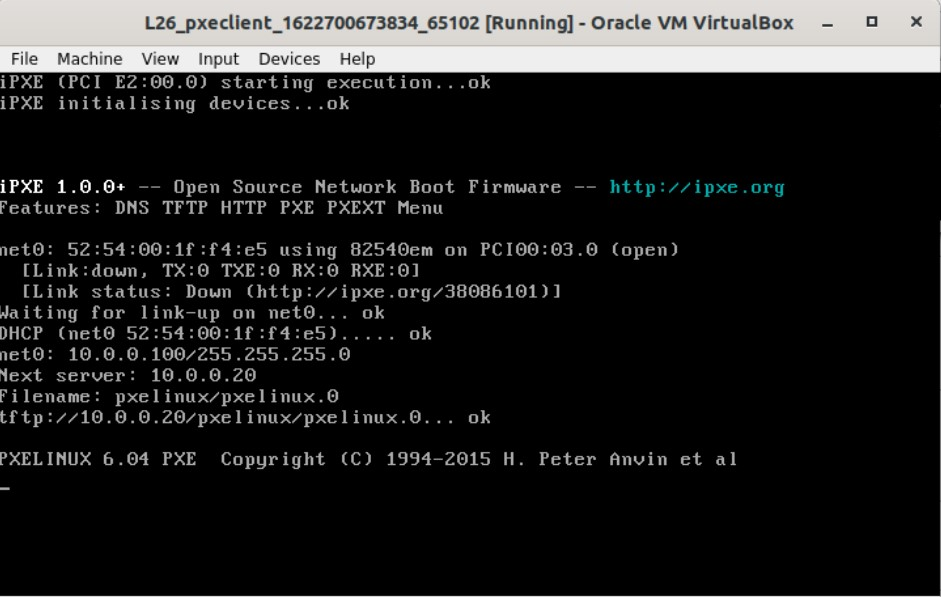
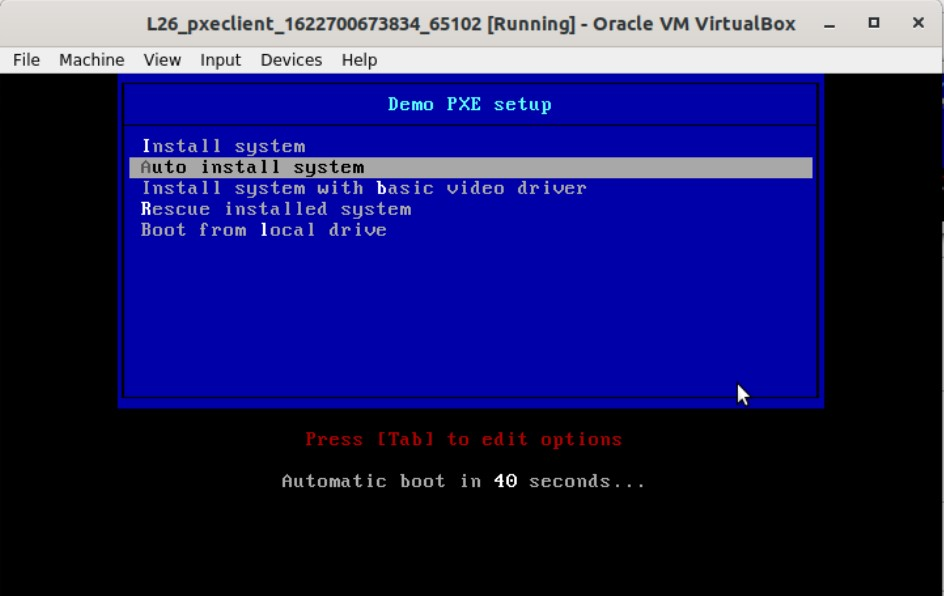
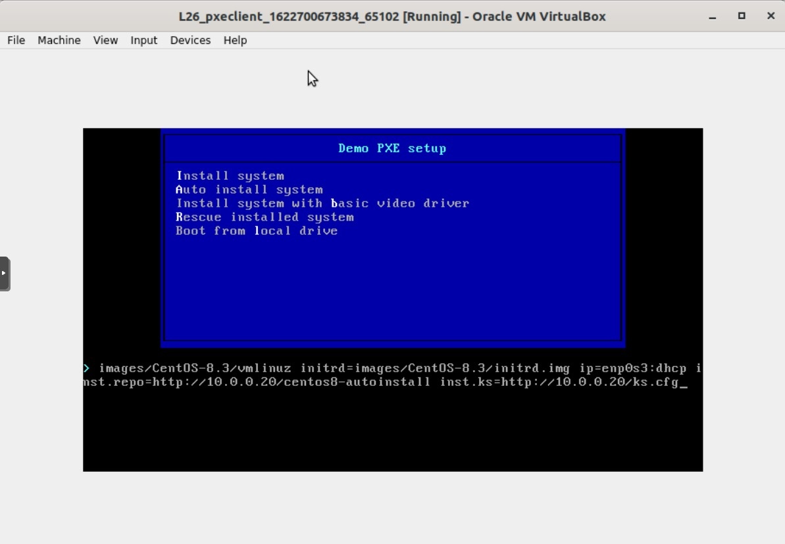
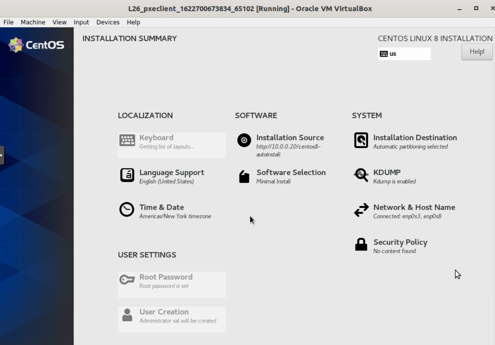
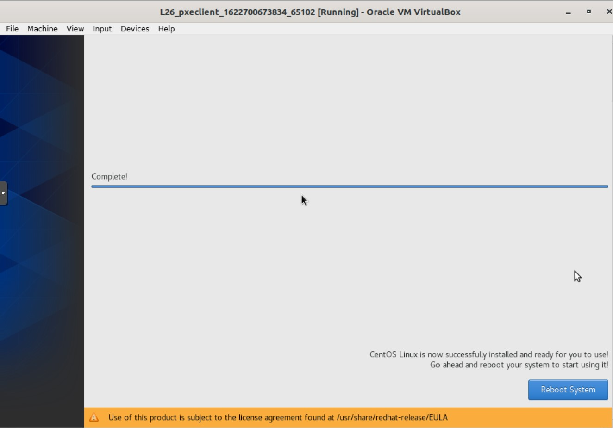

# ДЗ 26. DHCP, PXE

Настройка PXE сервера для автоматической установки
Цель:

Отрабатываем навыки установки и настройки DHCP, TFTP, PXE загрузчика и автоматической загрузки

* Следуя шагам из документа https://docs.centos.org/en-US/8-docs/advanced-install/assembly_preparing-for-a-network-install установить и настроить загрузку по сети для дистрибутива CentOS8

В качестве шаблона воспользуйтесь репозиторием https://github.com/nixuser/virtlab/tree/main/centos_pxe

Поменять установку из репозитория NFS на установку из репозитория HTTP

Настройить автоматическую установку для созданного kickstart файла (*) Файл загружается по HTTP

автоматизировать процесс установки Cobbler cледуя шагам из документа https://cobbler.github.io/quickstart/

-----
Для выполнения ДЗ в стендовом `Vagrantfile` увеличим память для обоих VM до 2048 и изменим в `setup_pxe.sh` автоматическую загрузку из `kickstart` файла по nfs на загрузку по http с VM `pxeserver` с установленного `nginx`:
```
...
LABEL linux-auto
  menu label ^Auto install system
  menu default
  kernel images/CentOS-8.3/vmlinuz
  append initrd=images/CentOS-8.3/initrd.img ip=enp0s3:dhcp inst.repo=http://10.0.0.20/centos8-install inst.ks=http://10.0.0.20/ks.cfg
...
```
После `vagrant up` поднимается две VM: `pxeserver` и `pxeclient`. На `pxeclient` запускается автоустановка с файла автоответов `ks.cfg`, скачиваемого по http с `pxeserver`.
Версия CentOS изменена на 8.3.2011.
```
...
curl -O http://ftp.mgts.by/pub/CentOS/8.3.2011/isos/x86_64/CentOS-8.3.2011-x86_64-minimal.iso
mkdir /mnt/centos8-install
mount -t iso9660 CentOS-8.3.2011-x86_64-minimal.iso /mnt/centos8-install
...
```




