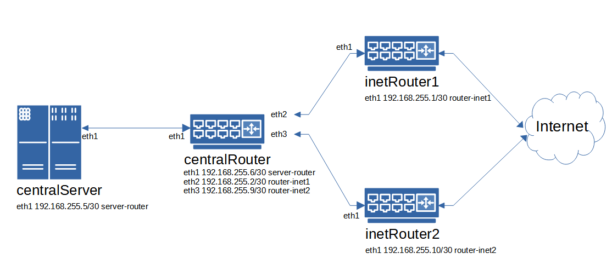

# ДЗ 27. Фильтрация трафика - firewalld, iptables

Сценарии iptables

* реализовать knocking port

* centralRouter может попасть на ssh inetrRouter через knock скрипт пример в материалах

* добавить inetRouter2, который виден(маршрутизируется (host-only тип сети для виртуалки)) с хоста или форвардится порт через локалхост

* запустить nginx на centralServer
* пробросить 80й порт на inetRouter2 8080
* дефолт в инет оставить через inetRouter
* реализовать проход на 80й порт без маскарадинга
-----

За основу взят стенд ДЗ по сетевой лаборатории. Убрал сети `Office1` и `Office2` со всем содержимым и добавил второй роутер (`inetRouter2`).

`Vagrantfile` поднимает 4 VM:
 
 * `inetRouter1`
 * `inetRouter2`
 * `centralRouter`
 * `centralServer`



Доступ в интернет с `centralServer` осуществляется с `inetRouter1`.

 ## Проброс порта
 Проверяется с хостовой машины до запущенного на `centralServer` *nginx* с изменённой стартовой страницей:
```
uk@otus01:~/L27/tmp5$ curl http://localhost:8080

!!! NEW default nginx page on centralServer
```
## Knocking port
На `inetRouter1` установлена серверная часть `knock`, на `centralRouter` - клиентская.

Доступ по *ssh* на `inetRouter1` c `centralRouter` отключен и включается для пользователя `knock`, если на него правильно постучаться:
```
1234:udp 2345:tcp 3456:udp.
```
Проверяем работу `knock`:
```
[vagrant@centralRouter ~]$ ssh knock@192.168.255.1
ssh: connect to host 192.168.255.1 port 22: Connection refused
```
Видим, что отбивает запрос по *ssh*.
Пробуем "постучаться" и ещё раз подключиться:
```
[vagrant@centralRouter ~]$ knock 192.168.255.1 1234:udp 2345:tcp 3456:udp
[vagrant@centralRouter ~]$ ssh knock@192.168.255.1
The authenticity of host '192.168.255.1 (192.168.255.1)' can't be established.
ECDSA key fingerprint is SHA256:AOj7Yea521DUHN85qjS7K9lOy0JM8NvWfoOk28Kf2NU.
ECDSA key fingerprint is MD5:35:db:34:bf:8f:23:18:3f:a8:e5:e6:7d:eb:32:69:53.
Are you sure you want to continue connecting (yes/no)? yes
Warning: Permanently added '192.168.255.1' (ECDSA) to the list of known hosts.
knock@192.168.255.1's password:
[knock@inetRouter1 ~]$
```
## Маршрутизация по умолчанию
Проверяем маршрутизацию по умолчанию с `centralServer` с помощью *traceroute*:
```
 [vagrant@centralServer ~]$ traceroute ya.ru
traceroute to ya.ru (87.250.250.242), 30 hops max, 60 byte packets
 1  gateway (192.168.255.6)  5.607 ms  5.467 ms  4.428 ms
 2  192.168.255.1            2.015 ms  1.883 ms  0.907 ms
 3  * * *
 4  * * *
 5  ya.ru (87.250.250.242)  28.381 ms  29.843 ms  28.283 ms
```
Трафик идёт через `inetRouter1`.