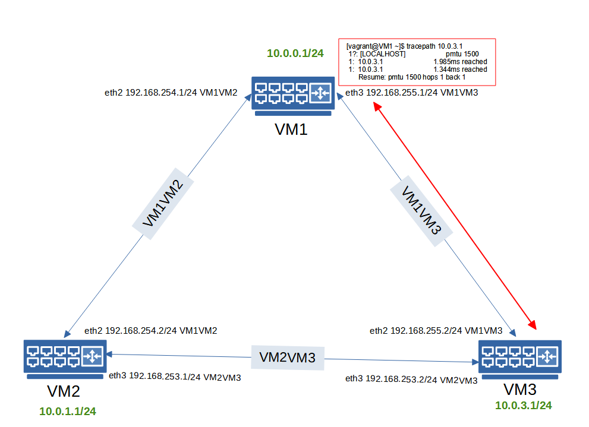
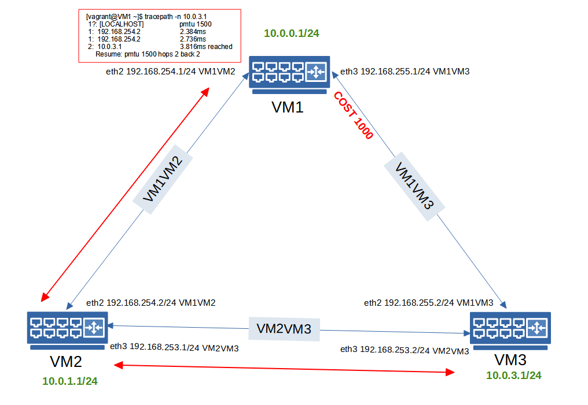
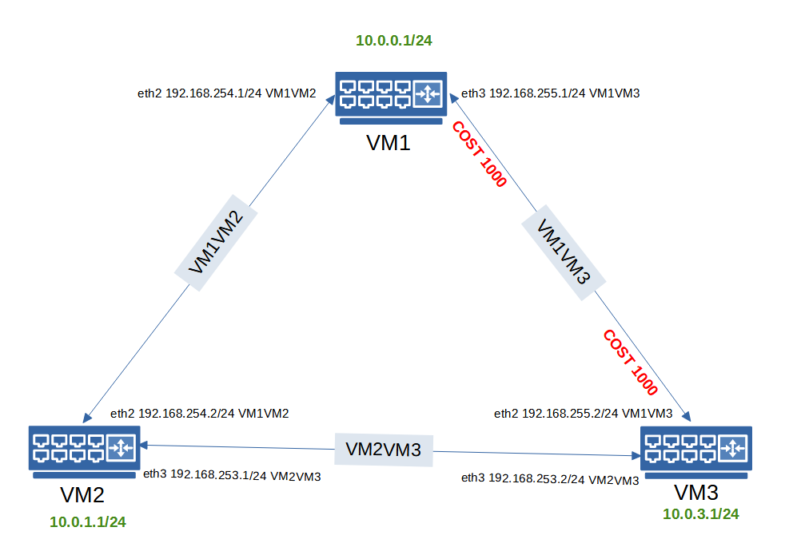

# ДЗ 29. Статическая и динамическая маршрутизация, OSPF
OSPF

* Поднять три виртуалки

*  Объединить их разными vlan

*    Поднять OSPF между машинами на базе Quagga
*    Изобразить ассиметричный роутинг
*    Сделать один из линков "дорогим", но что бы при этом роутинг был симметричным

Формат сдачи: Vagrantfile + ansible

---
`Vagrantfile` поднимает три виртуальные машины (*VM1*, *VM2* и *VM3*) и с помошью `Ansible` устанавливает и настраивает на них `Quagga`, отключает `SELinux`, настраивает маршрутизацию трафика через назные `VLAN` и копирует конфигурации для всех интерфейсов.

### 1. Проверяем прошождение трафика с VM1 на VM3:
```
[vagrant@VM1 ~]$ tracepath -n 10.0.3.1
 1?: [LOCALHOST]                                         pmtu 1500
 1:  10.0.3.1                                              2.448ms reached
 1:  10.0.3.1                                              2.062ms reached
     Resume: pmtu 1500 hops 1 back 1
```


### 2. Ассиметричный роутинг
Запускаем `ansible-playbook playbook2.yml`, который увеличивает стоимость на интерфейсе машины *VM1* (`eth3` `VLAN` *VM1VM3*) до 1000, после чего проветяем прохождение трафика и видим, что он идёт по другому маршруту, через *VM2*:
```
[vagrant@VM1 ~]$ tracepath -n 10.0.3.1
 1?: [LOCALHOST]                                         pmtu 1500
 1:  192.168.254.2                                         2.384ms
 1:  192.168.254.2                                         2.736ms
 2:  10.0.3.1                                              3.816ms reached
     Resume: pmtu 1500 hops 2 back 2
```


### 3. Симметричный "дорогой" роутинг
Запускаем `ansible-playbook playbook3.yml`, который увеличивает стоимость на интерфейсах машин *VM1* (`eth3` `VLAN` *VM1VM3*) и *VM3* (`eth2` `VLAN` *VM1VM3*). Получаем симметричный "дорогой" линк:
