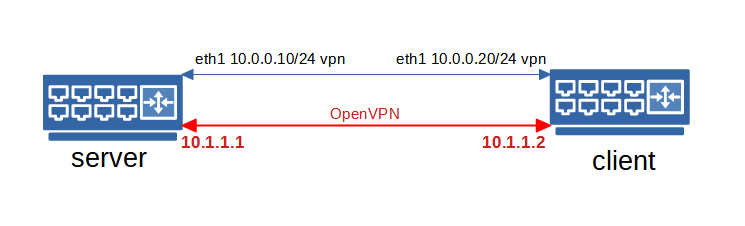
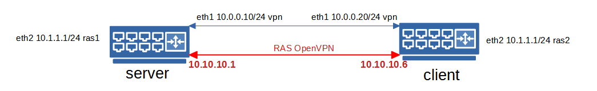

# ДЗ 31. Мосты, туннели и VPN
VPN

* Между двумя виртуалками поднять vpn в режимах

*    tun
*   tap Прочуствовать разницу.

*   Поднять RAS на базе OpenVPN с клиентскими сертификатами, подключиться с локальной машины на виртуалку

3*. Самостоятельно изучить, поднять ocserv и подключиться с хоста к виртуалке

----
[Стенд для проверки VPN в режимах tap, tun](taptun)

[Стенд для RAS на OpenVPN](ras)

### Проверяем VPN через tap:
`Vagrantfile` поднимает две виртуальные машины (*server*, *client*). Для проверки работы `VPN` в режимах `tap` и `tun` `Ansible` устанавливает и настраивает серверную и клиентскую часть `OpenVPN`, обновляет `epel`, отключает `SELinux` и открывает порт 5201 в `firewalld`. Ключ, сгенерированный на *server* копируется на *client*.

Получается следующая схема:



```
...
4: tap0: <BROADCAST,MULTICAST,UP,LOWER_UP> mtu 1500 qdisc pfifo_fast state UNKNOWN group default qlen 100
    link/ether 66:61:f5:0d:e5:61 brd ff:ff:ff:ff:ff:ff
    inet 10.1.1.1/24 brd 10.1.1.255 scope global tap0
       valid_lft forever preferred_lft forever
    inet6 fe80::6461:f5ff:fe0d:e561/64 scope link
       valid_lft forever preferred_lft forever
```
Запускаем `iperf3` на *server*:
```
[vagrant@server ~]$ iperf3 -s
-----------------------------------------------------------
Server listening on 5201
-----------------------------------------------------------

```
Проверяем прохождение трафика с *client*:
```
[vagrant@client ~]$ iperf3 -c 10.1.1.1 -t 100 -i 10
Connecting to host 10.1.1.1, port 5201
[  4] local 10.1.1.2 port 58958 connected to 10.1.1.1 port 5201
[ ID] Interval           Transfer     Bandwidth       Retr  Cwnd
[  4]   0.00-10.00  sec  14.2 MBytes  11.9 Mbits/sec    0    602 KBytes
[  4]  10.00-20.00  sec  13.9 MBytes  11.6 Mbits/sec  166   1.22 MBytes
[  4]  20.00-30.00  sec  12.5 MBytes  10.5 Mbits/sec   50   1.11 MBytes
[  4]  30.00-40.00  sec  12.3 MBytes  10.4 Mbits/sec   52    939 KBytes
[  4]  40.00-50.00  sec  13.6 MBytes  11.4 Mbits/sec   23    982 KBytes
[  4]  50.00-60.00  sec  12.3 MBytes  10.4 Mbits/sec    0   1.11 MBytes
[  4]  60.00-70.00  sec  13.6 MBytes  11.4 Mbits/sec   52   1.20 MBytes
[  4]  70.00-80.00  sec  12.4 MBytes  10.4 Mbits/sec   24   1.08 MBytes
[  4]  80.00-90.00  sec  12.3 MBytes  10.4 Mbits/sec   14   1.21 MBytes
[  4]  90.00-100.00 sec  13.6 MBytes  11.4 Mbits/sec   69    934 KBytes
- - - - - - - - - - - - - - - - - - - - - - - - -
[ ID] Interval           Transfer     Bandwidth       Retr
[  4]   0.00-100.00 sec   131 MBytes  11.0 Mbits/sec  450             sender
[  4]   0.00-100.00 sec   128 MBytes  10.8 Mbits/sec                  receiver

iperf Done.
```
### Проверяем VPN через tun:

Для смены режима запускаем плейбук `ansible-playbook playbook2.yml`, проверяем, что режим изменился на `tun`:
```
...
5: tun0: <POINTOPOINT,MULTICAST,NOARP,UP,LOWER_UP> mtu 1500 qdisc pfifo_fast state UNKNOWN group default qlen 100
    link/none
    inet 10.1.1.2/24 brd 10.1.1.255 scope global tun0
       valid_lft forever preferred_lft forever
    inet6 fe80::85bb:6799:4e28:c3cc/64 scope link flags 800
       valid_lft forever preferred_lft forever
```
Проверяем прохождение трафика с *client*:
```
[vagrant@client ~]$ iperf3 -c 10.1.1.1 -t 100 -i 10
Connecting to host 10.1.1.1, port 5201
[  4] local 10.1.1.2 port 59542 connected to 10.1.1.1 port 5201
[ ID] Interval           Transfer     Bandwidth       Retr  Cwnd
[  4]   0.00-10.00  sec  14.8 MBytes  12.4 Mbits/sec    0    589 KBytes
[  4]  10.00-20.01  sec  13.6 MBytes  11.4 Mbits/sec   61    546 KBytes
[  4]  20.01-30.01  sec  14.1 MBytes  11.8 Mbits/sec   17    468 KBytes
[  4]  30.01-40.00  sec  13.4 MBytes  11.2 Mbits/sec    5    552 KBytes
[  4]  40.00-50.00  sec  13.8 MBytes  11.6 Mbits/sec   16    358 KBytes
[  4]  50.00-60.00  sec  14.8 MBytes  12.4 Mbits/sec    5    390 KBytes
[  4]  60.00-70.00  sec  13.7 MBytes  11.5 Mbits/sec   24    403 KBytes
[  4]  70.00-80.00  sec  13.0 MBytes  10.9 Mbits/sec    0    687 KBytes
[  4]  80.00-90.00  sec  14.1 MBytes  11.8 Mbits/sec   50    554 KBytes
[  4]  90.00-100.00 sec  14.0 MBytes  11.7 Mbits/sec   16    495 KBytes
- - - - - - - - - - - - - - - - - - - - - - - - -
[ ID] Interval           Transfer     Bandwidth       Retr
[  4]   0.00-100.00 sec   139 MBytes  11.7 Mbits/sec  194             sender
[  4]   0.00-100.00 sec   138 MBytes  11.6 Mbits/sec                  receiver

iperf Done.
```
Сравнивая скорость пропускную способность режимов `tap` и `tun`, можно говорить, что `tun` незначительно выше.
Основное различие в режимах - это то, что `tun` работает в `L3`, а `tap` в `L2`. Например, если нужно объединить две разные локальные сети в одну условно общую, но с разной адресацией, то нужен `tun`. Если же стоит задача объединить 2 удаленные сети в единое адресное пространство, например сделать и в офисе, и в филиале единую сеть, то тогда используется `tap` интерфейс. Оба офиса окажутся в одном широковещательном домене и смогут передавать данные с помощью широковещания на канальном уровне сетевой модели OSI.

## Поднимаем RAS на базе OpenVPN
`Vagrantfile` поднимает две виртуальные машины (*server*, *client*), `Ansible` устанавливает и настраивает серверную и клиентскую часть `OpenVPN`, обновляет `epel`, отключает `SELinux`, открывает порт 5201 в `firewalld` и копирует сгенерированные сертификаты и ключи на *server* и *client*.

Получается следующая схема:



Для настройки `OpenVPN` сервера следует проделать следующие действия.

* Инициализация pki:
```
cd /etc/openvpn/ && /usr/share/easy-rsa/3/easyrsa init-pki
```
* Создание корневого сертификата:
```
echo 'rasvpnCA' | /usr/share/easy-rsa/3/easyrsa build-ca nopass
```
* Запрос и генерация сертификата:
```
echo 'rasvpnSRV' | /usr/share/easy-rsa/3/easyrsa gen-req server nopass
echo 'yes' | /usr/share/easy-rsa/3/easyrsa sign-req server server
```
* Создание ключа Диффи-Хеллмана:
```
/usr/share/easy-rsa/3/easyrsa gen-dh # pki/dh.pem
```
* Cоздание ta ключа:
```
openvpn --genkey --secret ta.key
```
* Генерация ключа для клиента:
```
echo 'rasvpnCL' | /usr/share/easy-rsa/3/easyrsa gen-req client nopass
echo 'yes' | /usr/share/easy-rsa/3/easyrsa sign-req client client
```
* Генерация списка отозванных сертификатов:
```
/usr/share/easy-rsa/3/easyrsa gen-crl # pki/crl.pem
```
Создаём конфиг сервера:
```
port 1207
proto udp
dev tun
ca /etc/openvpn/ca.crt
cert /etc/openvpn/server.crt
key /etc/openvpn/server.key
dh /etc/openvpn/dh.pem
server 10.10.10.0 255.255.255.0
push "route 10.1.1.0 255.255.255.0"
ifconfig-pool-persist ipp.txt
client-to-client
client-config-dir /etc/openvpn/client
keepalive 10 120
comp-lzo
persist-key
persist-tun
status /var/log/openvpn-status.log
log /var/log/openvpn.log
verb 3
```
Создаём конфиг клиента:
```
dev tun
proto udp
remote 10.0.0.10 1207
client
resolv-retry infinite
ca /etc/openvpn/ca.crt
cert /etc/openvpn/client.crt
key /etc/openvpn/client.key
persist-key
persist-tun
comp-lzo
verb 3
```
Проверяем работу OpenVPN c клиента:
```
Connecting to host 10.10.10.1, port 5201
[  4] local 10.10.10.6 port 38018 connected to 10.10.10.1 port 5201
[ ID] Interval           Transfer     Bandwidth       Retr  Cwnd
[  4]   0.00-10.00  sec  18.5 MBytes  15.5 Mbits/sec   21    508 KBytes
[  4]  10.00-20.00  sec  15.3 MBytes  12.9 Mbits/sec    8    550 KBytes
[  4]  20.00-30.00  sec  17.1 MBytes  14.4 Mbits/sec   16    611 KBytes
[  4]  30.00-40.00  sec  17.5 MBytes  14.7 Mbits/sec    5    552 KBytes
[  4]  40.00-50.00  sec  18.4 MBytes  15.4 Mbits/sec   11    645 KBytes
[  4]  50.00-60.00  sec  20.1 MBytes  16.8 Mbits/sec    4    565 KBytes
[  4]  60.00-70.01  sec  16.4 MBytes  13.8 Mbits/sec   17    466 KBytes
[  4]  70.01-80.00  sec  16.0 MBytes  13.4 Mbits/sec    0    595 KBytes
[  4]  80.00-90.00  sec  17.0 MBytes  14.3 Mbits/sec   26    521 KBytes
[  4]  90.00-100.00 sec  16.8 MBytes  14.1 Mbits/sec    1    659 KBytes
- - - - - - - - - - - - - - - - - - - - - - - - -
[ ID] Interval           Transfer     Bandwidth       Retr
[  4]   0.00-100.00 sec   173 MBytes  14.5 Mbits/sec  109             sender
[  4]   0.00-100.00 sec   172 MBytes  14.4 Mbits/sec                  receiver
```
