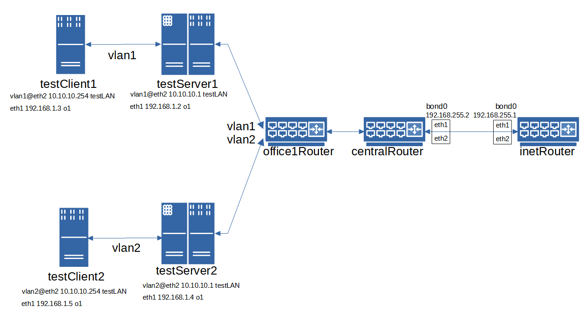

# ДЗ 33. Сетевые пакеты. VLAN'ы. LACP
Строим бонды и вланы

в Office1 в тестовой подсети появляется сервера с доп интерфесами и адресами в internal сети testLAN

    testClient1 - 10.10.10.254
    testClient2 - 10.10.10.254
    testServer1- 10.10.10.1
    testServer2- 10.10.10.1

равести вланами testClient1 <-> testServer1 testClient2 <-> testServer2

между centralRouter и inetRouter "пробросить" 2 линка (общая inernal сеть) и объединить их в бонд проверить работу c отключением интерфейсов

---
На базе созданного ранее для ДЗ по архитектуре сетей стенда готовим новый стенд, отвечающий требованиям текущего ДЗ. Убрал хосты, не указанные в ДЗ и добавил новые. Стенд состоит из 7 `VM`. Ниже представлена схема.



Как и требуется в задании, `VM` *testClient1*, *testServer1* и *testClient2*, *testServer2* разведены по зазным `VLANам` и должны нормально работать имея одинаковую адресацию.

Отказоустойчивость канала между *centralRouter* и *inetRouter* достагается путём объединения в `bond` двух дополнительно проброшенных линков.

Сетевые настройки интерфейсов `VM`, объединение в `bond` и прописание VLAN реализованы через проброс конфигураций `ifcfg` внутрь `VM`.

### Проверка работы стенда: ###
* Разделение на `VLANы` проверим через `ping` с клинетов на серверы.
В `vlan1`:

```
[vagrant@testClient1 ~]$ ping 10.10.10.1
PING 10.10.10.1 (10.10.10.1) 56(84) bytes of data.
64 bytes from 10.10.10.1: icmp_seq=1 ttl=64 time=3.84 ms
64 bytes from 10.10.10.1: icmp_seq=2 ttl=64 time=1.92 ms
64 bytes from 10.10.10.1: icmp_seq=3 ttl=64 time=1.70 ms
64 bytes from 10.10.10.1: icmp_seq=4 ttl=64 time=1.53 ms
...
```

Дамп пакетов со стороны отвечающей `VM`:

```
[root@testServer1 vagrant]# tcpdump -i vlan1
tcpdump: verbose output suppressed, use -v or -vv for full protocol decode
listening on vlan1, link-type EN10MB (Ethernet), capture size 262144 bytes
09:11:33.068021 ARP, Request who-has testServer1 tell 10.10.10.254, length 46
09:11:33.068112 ARP, Reply testServer1 is-at 08:00:27:94:34:3b (oui Unknown), length 28
09:11:33.069780 IP 10.10.10.254 > testServer1: ICMP echo request, id 25367, seq 1, length 64
09:11:33.069843 IP testServer1 > 10.10.10.254: ICMP echo reply, id 25367, seq 1, length 64
09:11:34.069794 IP 10.10.10.254 > testServer1: ICMP echo request, id 25367, seq 2, length 64
09:11:34.069841 IP testServer1 > 10.10.10.254: ICMP echo reply, id 25367, seq 2, length 64
09:11:35.071881 IP 10.10.10.254 > testServer1: ICMP echo request, id 25367, seq 3, length 64
09:11:38.077484 IP 10.10.10.254 > testServer1: ICMP echo request, id 25367, seq 6, length 64
...
```

Аналонично для второй пары *client-server* в `vlan2`:
```
[vagrant@testClient2 ~]$ ping 10.10.10.1
PING 10.10.10.1 (10.10.10.1) 56(84) bytes of data.
64 bytes from 10.10.10.1: icmp_seq=1 ttl=64 time=3.02 ms
64 bytes from 10.10.10.1: icmp_seq=2 ttl=64 time=1.77 ms
64 bytes from 10.10.10.1: icmp_seq=3 ttl=64 time=1.85 ms
64 bytes from 10.10.10.1: icmp_seq=4 ttl=64 time=1.68 ms
...
```
Дамп пакетов со стороны отвечающей VM:

```
[root@testServer2 vagrant]# tcpdump -i vlan2
tcpdump: verbose output suppressed, use -v or -vv for full protocol decode
listening on vlan2, link-type EN10MB (Ethernet), capture size 262144 bytes
09:20:25.720596 ARP, Request who-has testServer2 tell 10.10.10.254, length 46
09:20:25.720649 ARP, Reply testServer2 is-at 08:00:27:93:c2:e9 (oui Unknown), length 28
09:20:25.721981 IP 10.10.10.254 > testServer2: ICMP echo request, id 24039, seq 1, length 64
09:20:25.722047 IP testServer2 > 10.10.10.254: ICMP echo reply, id 24039, seq 1, length 64
09:20:26.722182 IP 10.10.10.254 > testServer2: ICMP echo request, id 24039, seq 2, length 64
...
```
* Проверка отказоустойчивости и работы `bond`.

Проверяем настройки сетевых интерфейсов на *centralRouter* и *inetRouter*.
```
[vagrant@centralRouter ~]$ ip a
1: lo: <LOOPBACK,UP,LOWER_UP> mtu 65536 qdisc noqueue state UNKNOWN group default qlen 1000
    link/loopback 00:00:00:00:00:00 brd 00:00:00:00:00:00
    inet 127.0.0.1/8 scope host lo
       valid_lft forever preferred_lft forever
    inet6 ::1/128 scope host
       valid_lft forever preferred_lft forever
2: eth0: <BROADCAST,MULTICAST,UP,LOWER_UP> mtu 1500 qdisc pfifo_fast state UP group default qlen 1000
    link/ether 52:54:00:4d:77:d3 brd ff:ff:ff:ff:ff:ff
    inet 10.0.2.15/24 brd 10.0.2.255 scope global noprefixroute dynamic eth0
       valid_lft 82074sec preferred_lft 82074sec
    inet6 fe80::5054:ff:fe4d:77d3/64 scope link
       valid_lft forever preferred_lft forever
3: eth1: <BROADCAST,MULTICAST,SLAVE,UP,LOWER_UP> mtu 1500 qdisc pfifo_fast master bond0 state UP group default qlen 1000
    link/ether 08:00:27:e4:ed:1e brd ff:ff:ff:ff:ff:ff
4: eth2: <BROADCAST,MULTICAST,SLAVE,UP,LOWER_UP> mtu 1500 qdisc pfifo_fast master bond0 state UP group default qlen 1000
    link/ether 08:00:27:ab:92:c0 brd ff:ff:ff:ff:ff:ff
6: bond0: <BROADCAST,MULTICAST,MASTER,UP,LOWER_UP> mtu 1500 qdisc noqueue state UP group default qlen 1000
    link/ether 08:00:27:e4:ed:1e brd ff:ff:ff:ff:ff:ff
    inet 192.168.255.2/30 brd 192.168.255.3 scope global noprefixroute bond0
       valid_lft forever preferred_lft forever
    inet6 fe80::a00:27ff:fee4:ed1e/64 scope link
       valid_lft forever preferred_lft forever
```
```
[vagrant@inetRouter ~]$ ip a
1: lo: <LOOPBACK,UP,LOWER_UP> mtu 65536 qdisc noqueue state UNKNOWN group default qlen 1000
    link/loopback 00:00:00:00:00:00 brd 00:00:00:00:00:00
    inet 127.0.0.1/8 scope host lo
       valid_lft forever preferred_lft forever
    inet6 ::1/128 scope host
       valid_lft forever preferred_lft forever
2: eth0: <BROADCAST,MULTICAST,UP,LOWER_UP> mtu 1500 qdisc pfifo_fast state UP group default qlen 1000
    link/ether 52:54:00:4d:77:d3 brd ff:ff:ff:ff:ff:ff
    inet 10.0.2.15/24 brd 10.0.2.255 scope global noprefixroute dynamic eth0
       valid_lft 82028sec preferred_lft 82028sec
    inet6 fe80::5054:ff:fe4d:77d3/64 scope link
       valid_lft forever preferred_lft forever
3: eth1: <BROADCAST,MULTICAST,SLAVE,UP,LOWER_UP> mtu 1500 qdisc pfifo_fast master bond0 state UP group default qlen 1000
    link/ether 08:00:27:37:dd:46 brd ff:ff:ff:ff:ff:ff
4: eth2: <BROADCAST,MULTICAST,SLAVE,UP,LOWER_UP> mtu 1500 qdisc pfifo_fast master bond0 state UP group default qlen 1000
    link/ether 08:00:27:55:ca:f0 brd ff:ff:ff:ff:ff:ff
6: bond0: <BROADCAST,MULTICAST,MASTER,UP,LOWER_UP> mtu 1500 qdisc noqueue state UP group default qlen 1000
    link/ether 08:00:27:37:dd:46 brd ff:ff:ff:ff:ff:ff
    inet 192.168.255.1/30 brd 192.168.255.3 scope global noprefixroute bond0
       valid_lft forever preferred_lft forever
    inet6 fe80::a00:27ff:fe37:dd46/64 scope link
       valid_lft forever preferred_lft forever

```
Запускаем `ping` и после этого отключаем один из интерфейсов из `bond0`
```
[root@centralRouter vagrant]# ifdown eth1
Device 'eth1' successfully disconnected.
```
Видим, что интерфейс отключен, активный интерфейс `bond0` теперь `eth2`.
```
[root@centralRouter vagrant]# cat /proc/net/bonding/bond0
Ethernet Channel Bonding Driver: v3.7.1 (April 27, 2011)

Bonding Mode: fault-tolerance (active-backup) (fail_over_mac active)
Primary Slave: None
Currently Active Slave: eth2
MII Status: up
MII Polling Interval (ms): 100
Up Delay (ms): 0
Down Delay (ms): 0

Slave Interface: eth2
MII Status: up
Speed: 1000 Mbps
Duplex: full
Link Failure Count: 0
Permanent HW addr: 08:00:27:ab:92:c0
Slave queue ID: 0
```
Пакеты не тяряются.
```
[root@centralRouter vagrant]# ping 192.168.255.1
PING 192.168.255.1 (192.168.255.1) 56(84) bytes of data.
64 bytes from 192.168.255.1: icmp_seq=1 ttl=64 time=4.18 ms
64 bytes from 192.168.255.1: icmp_seq=2 ttl=64 time=1.73 ms
64 bytes from 192.168.255.1: icmp_seq=3 ttl=64 time=1.73 ms
64 bytes from 192.168.255.1: icmp_seq=4 ttl=64 time=1.80 ms
64 bytes from 192.168.255.1: icmp_seq=5 ttl=64 time=1.68 ms
...
```