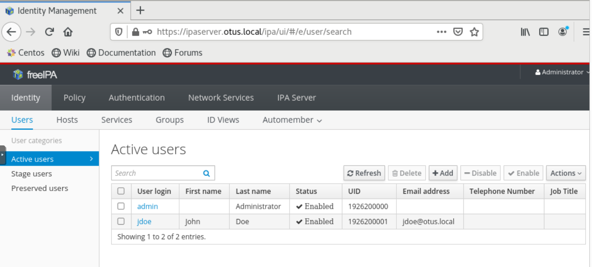

# ДЗ 34. LDAP. Централизованная авторизация и аутентификация
LDAP
*    Установить FreeIPA;
*    Написать Ansible playbook для конфигурации клиента; 3*. Настроить аутентификацию по SSH-ключам; 4**. Firewall должен быть включен на сервере и на клиенте.
---
`Vagrantfile` поднимает 2 `VM` (*ipaserver.otus.local* и *ipaclient.otus.local*).

* Ansible конфигурирует каждую из машин:

 1.  На *ipaserver.otus.local* устанавливаются `firewalld`, `nss`, `ipa-server` и `ipa-server-dns`.

     Прописываем в hosts данные *ipaserver.otus.local*.
     
     Устанивливаем и настраиваем ipa-server:
     ```
     ipa-server-install --domain=otus.local --realm=OTUS.LOCAL --ds-password=password --admin-password=password --hostname=ipaserver.otus.local --ip-address=192.168.255.1 --reverse-zone=255.168.192.in-addr.arpa. --forwarder=8.8.8.8 --setup-dns --unattended
     ```
  2. На *ipaclient.otus.local* устанавливаются `firewalld`, `nss`, и `ipa-client`.

     Прописываем в hosts данные *ipaserver.otus.local* и *ipaclient.otus.local*.

     Настраиваем dns.

     Устанивливаем и настраиваем ipa-client:
     ```
     ipa-client-install --domain 'otus.local' --principal 'admin' --password 'password' --unattended
     ```

     Настраиваем доступ по ssh.

### Проверяем работу стенда. ###
Пробуем подключатся с клиента на сервер по `ssh` (пароль "`password`"):

```
[root@ipaclient vagrant]# ssh -vvv admin@ipaserver.otus.local
OpenSSH_7.4p1, OpenSSL 1.0.2k-fips  26 Jan 2017
debug1: Reading configuration data /etc/ssh/ssh_config
debug1: /etc/ssh/ssh_config line 62: Applying options for *
debug1: Executing proxy command: exec /usr/bin/sss_ssh_knownhostsproxy -p 22 ipaserver.otus.local
debug1: permanently_set_uid: 0/0
debug1: identity file /root/.ssh/id_rsa type 1
debug1: key_load_public: No such file or directory
debug1: identity file /root/.ssh/id_rsa-cert type -1
debug1: key_load_public: No such file or directory
...
debug2: PTY allocation request accepted on channel 0
debug2: channel 0: rcvd adjust 2097152
debug3: receive packet: type 99
debug2: channel_input_status_confirm: type 99 id 0
debug2: shell request accepted on channel 0
Could not chdir to home directory /home/admin: No such file or directory
-bash-4.2$
```

Пробуем подключатся с клиента на сервер c `kerberos` авторизацией (пароль "`password`"):
```
[root@ipaclient vagrant]# kinit admin
Password for admin@OTUS.LOCAL:
[root@ipaclient vagrant]# ssh -vvv admin@ipaserver.otus.local
OpenSSH_7.4p1, OpenSSL 1.0.2k-fips  26 Jan 2017
debug1: Reading configuration data /etc/ssh/ssh_config
debug1: /etc/ssh/ssh_config line 62: Applying options for *
debug1: Executing proxy command: exec /usr/bin/sss_ssh_knownhostsproxy -p 22 ipaserver.otus.local
debug1: permanently_set_uid: 0/0
debug1: permanently_drop_suid: 0
debug1: identity file /root/.ssh/id_rsa type 1
debug1: key_load_public: No such file or directory
debug1: identity file /root/.ssh/id_rsa-cert type -1
debug1: key_load_public: No such file or directory
...
debug3: Ignored env _
debug2: channel 0: request shell confirm 1
debug3: send packet: type 98
debug2: callback done
debug2: channel 0: open confirm rwindow 0 rmax 32768
debug3: receive packet: type 99
debug2: channel_input_status_confirm: type 99 id 0
debug2: PTY allocation request accepted on channel 0
debug2: channel 0: rcvd adjust 2097152
debug3: receive packet: type 99
debug2: channel_input_status_confirm: type 99 id 0
debug2: shell request accepted on channel 0
Last login: Fri Jul 30 09:18:37 2021 from 192.168.255.2
Could not chdir to home directory /home/admin: No such file or directory
-bash-4.2$
```
Пробуем cоздавать `LDAP` пользователя на сервере:
```
[vagrant@ipaserver ~]$ ipa user-add --first="John" --last="Doe" --cn="John DOe" --shell="/bin/bash" --password
User login [jdoe]:
Password:
Enter Password again to verify:
-----------------
Added user "jdoe"
-----------------
  User login: jdoe
  First name: John
  Last name: Doe
  Full name: John DOe
  Display name: John Doe
  Initials: JD
  Home directory: /home/jdoe
  GECOS: John Doe
  Login shell: /bin/bash
  Principal name: jdoe@OTUS.LOCAL
  Principal alias: jdoe@OTUS.LOCAL
  User password expiration: 20210730093200Z
  Email address: jdoe@otus.local
  UID: 1926200001
  GID: 1926200001
  Password: True
  Member of groups: ipausers
  Kerberos keys available: True
[vagrant@ipaserver ~]$
```
Пробуем зайти под созданным пользователем с клиента:
```
[vagrant@ipaclient ~]$ su -l jdoe
Password:
Password expired. Change your password now.
Current Password:
New password:
Retype new password:
su: warning: cannot change directory to /home/jdoe: No such file or directory
-bash-4.2$
```
Смотрим созданного пользователя через WebUI:
 